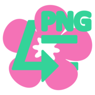

# Cute.Converter (^=◕ᴥ◕=^)
### Enjoy the chaos! Ideal for when you need fast and free image convert

<header>

</header>

Wanna see this in action? Hit up [cc.imeow.pro](http://cc.imeow.pro) for a demo. 

## ⚠️ It's my learning space Σ(°△°|||)︴

You've just landed on my learning playground. Don't be surprised if you see a ton of commits that seem pointless (≧◡≦)